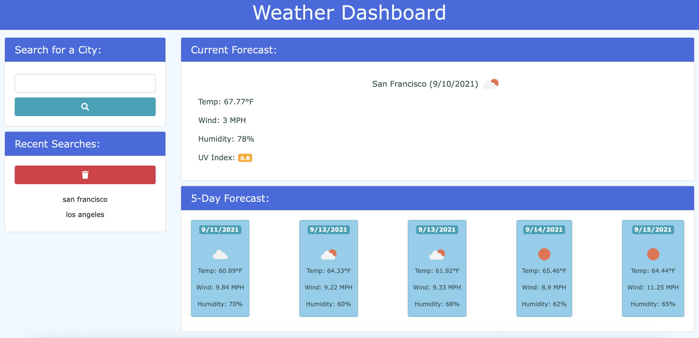
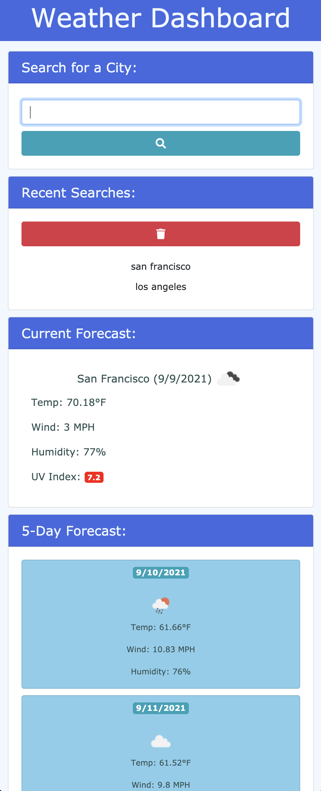

<!-- PROJECT SHIELDS -->
<!--
*** I'm using markdown "reference style" links for readability.
*** Reference links are enclosed in brackets [ ] instead of parentheses ( ).
*** See the bottom of this document for the declaration of the reference variables
*** for contributors-url, forks-url, etc. This is an optional, concise syntax you may use.
*** https://www.markdownguide.org/basic-syntax/#reference-style-links
-->
[![Contributors][contributors-shield]][contributors-url]
[![Forks][forks-shield]][forks-url]
[![Stargazers][stars-shield]][stars-url]
[![Issues][issues-shield]][issues-url]


<!-- PROJECT LOGO -->
<br />
<p align="center">
  <a href="https://jsun994.github.io/weather-dashboard/">
    
  </a>

  <h3 align="center">Weather Dashboard</h3>

  <p align="center">
  A weather dashboard application that displays the weather for mulitple cities.
    <br />
    <a href="https://github.com/jsun994/weather-dashboard"><strong>Explore the docs »</strong></a>
    <br />
    <br />
    <a href="https://github.com/jsun994/weather-dashboard">View Demo</a>
    ·
    <a href="https://github.com/jsun994/weather-dashboard/issues">Report Bug</a>
    ·
    <a href="https://github.com/jsun994/weather-dashboard/issues">Request Feature</a>
  </p>
</p>


<!-- TABLE OF CONTENTS -->
<details open="open">
  <summary><h2 style="display: inline-block">Table of Contents</h2></summary>
  <ol>
    <li>
      <a href="#about-the-project">About The Project</a>
      <ul>
        <li><a href="#built-with">Built With</a></li>
      </ul>
    </li>
    <li>
      <a href="#getting-started">Getting Started</a>
      <ul>
        <li><a href="#prerequisites">Prerequisites</a></li>
        <li><a href="#installation">Installation</a></li>
      </ul>
    </li>
    <li><a href="#usage">Usage</a></li>
    <li><a href="#roadmap">Roadmap</a></li>
    <li><a href="#contributing">Contributing</a></li>
    <li><a href="#contact">Contact</a></li>
    <li><a href="#acknowledgements">Acknowledgements</a></li>
  </ol>
</details>


<!-- ABOUT THE PROJECT -->
## About The Project




### Built With

* HTML
* CSS
* JS


<!-- GETTING STARTED -->
## Getting Started

To get a local copy up and running follow these simple steps.

### Prerequisites

This is an example of how to list things you need to use the software and how to install them.
* npm
  ```sh
  npm install npm@latest -g
  ```

### Installation

1. Clone the repo
   ```sh
   git clone git@github.com:jsun994/weather-dashboard.git
   ```
2. Install NPM packages
   ```sh
   npm install
   ```


<!-- USAGE EXAMPLES -->
## Usage

* The user enters a city in the form input.
* The user is then presented with the current and future weather conditions for that city.
* The city is added to the search history.
* The current forecast shows the city name, the date, an icon representation of weather conditions, the temperature, the humidity, the wind speed, and the UV index.
* The UV index has a color that indicates whether the conditions are favorable, moderate, or severe.
* The five day forecast displays the date, an icon representation of weather conditions, the temperature, the wind speed, and the humidity.
* The user can also click on a city in the search history.
* Then user is again presented with the current and furture forecasts for that city.
* The user can clear the search history.





<!-- ROADMAP -->
## Roadmap

See the [open issues](https://github.com/jsun994/weather-dashboard/issues) for a list of proposed features (and known issues).


<!-- CONTRIBUTING -->
## Contributing

1. Fork the Project
2. Create your Feature Branch (`git checkout -b feature/AmazingFeature`)
3. Commit your Changes (`git commit -m 'Add some AmazingFeature'`)
4. Push to the Branch (`git push origin feature/AmazingFeature`)
5. Open a Pull Request


<!-- CONTACT -->
## Contact

Jay Sun - jaysun054@gmail.com

Project Link: [https://github.com/jsun994/weather-dashboard/]