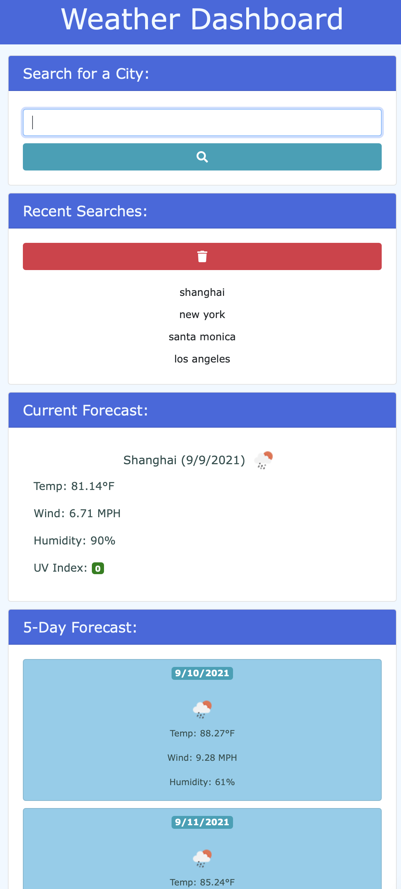

# Weather Dashboard

## Purpose
A weather dashboard application that displays the weather for mulitple cities

## Built With
* HTML
* CSS
* JS

## Website
https://jsun994.github.io/weather-dashboard/

## Description
The user enters a city in the form input.
The user is then presented with the current and future weather conditions for that city.
The city is added to the search history.
The current forecast shows the city name, the date, an icon representation of weather conditions, the temperature, the humidity, the wind speed, and the UV index.
The UV index has a color that indicates whether the conditions are favorable, moderate, or severe.
The five day forecast displays the date, an icon representation of weather conditions, the temperature, the wind speed, and the humidity.
The user can also click on a city in the search history.
Then user is again presented with the current and furture forecasts for that city.

